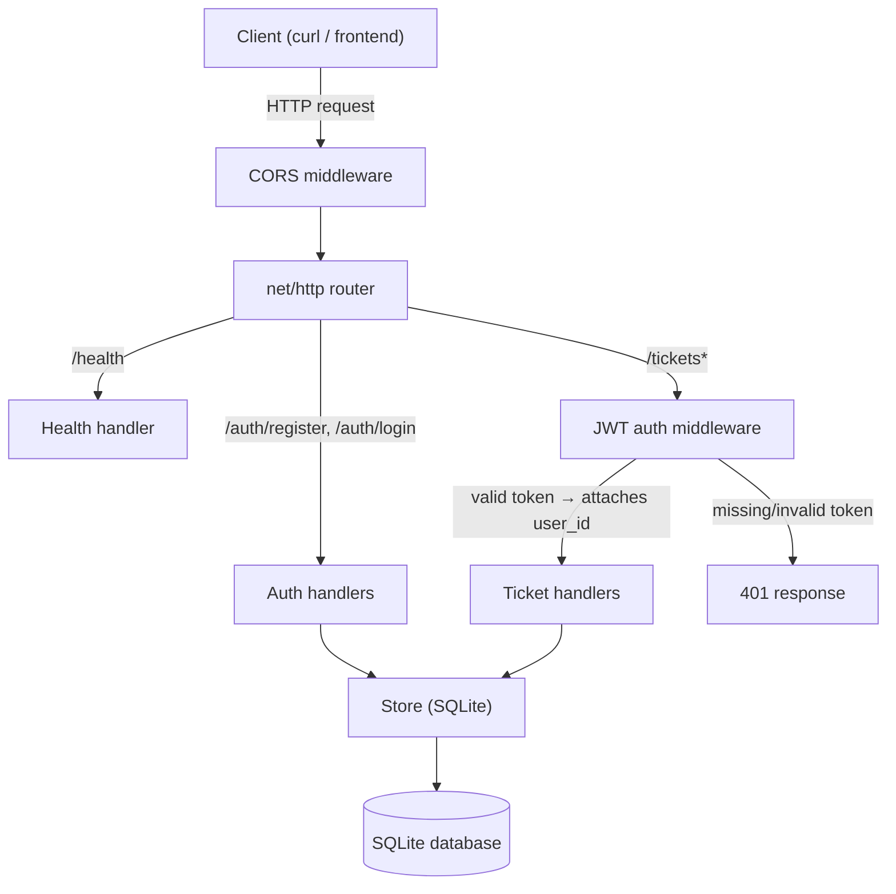
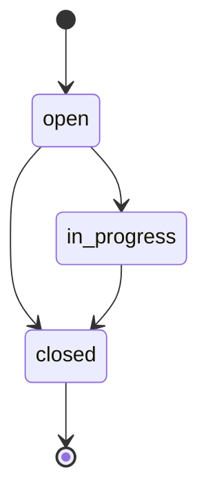

# Ticket Desk — Backend Intern Assignment

A backend service where users can register, log in, create tickets, view
their own tickets, and update the status of their own tickets — built in
Go, backed by SQLite, secured with JWT auth and bcrypt password hashing.

A minimal frontend is included as a bonus on top of the required backend.

---

## Live Links

| What | URL |
|---|---|
| Backend API | https://ticket-system-2vw9.onrender.com |
| Public health check | https://ticket-system-2vw9.onrender.com/health |
| Frontend | https://ticket-system-1-ty2z.onrender.com/ |
| GitHub repo | https://github.com/Harshul017/ticket-system |

---

## Architecture



**Request flow for a protected route** (e.g. `PATCH /tickets/{id}/status`):
1. CORS middleware attaches headers so browser clients can call the API.
2. JWT middleware checks the `Authorization: Bearer <token>` header. Invalid
   or missing tokens are rejected with `401` before reaching any handler.
3. The handler reads the authenticated `user_id` from the request context
   (never from the request body — this is what makes ownership checks
   trustworthy) and fetches the ticket from the store.
4. If the ticket doesn't exist, or exists but belongs to a different user,
   the handler returns `404` either way — see [Assumptions](#assumptions).
5. If it's owned by the caller, the requested change is validated (e.g.
   against the status state machine below) and applied.

## Ticket Status State Machine



A ticket starts as `open`. It can move to `in_progress` or be closed
directly. Once `closed`, no further transitions are allowed — it cannot be
reopened or moved back to `in_progress`.

---

## Folder Structure

```
ticket-system/
├── main.go                        # Entry point: wires store, handlers, routes
├── go.mod / go.sum                # Go module and dependency lockfile
├── Dockerfile                     # Multi-stage build for containerized deploy
├── .dockerignore
├── .env.example                   # Documents required environment variables
├── frontend/
│   └── index.html                 # Standalone UI (bonus, calls the API directly)
└── internal/
    ├── models/
    │   └── models.go               # User, Ticket structs; status constants
    ├── store/
    │   └── store.go                # SQLite access layer (all SQL lives here)
    ├── auth/
    │   └── auth.go                  # bcrypt hashing, JWT issue/verify
    ├── middleware/
    │   ├── auth.go                  # JWT-checking middleware for protected routes
    │   └── cors.go                  # Allows the browser frontend to call the API
    └── handlers/
        ├── auth_handlers.go         # POST /auth/register, POST /auth/login
        ├── ticket_handlers.go       # All /tickets* endpoints
        └── response.go              # Shared JSON response helpers
```

`internal/` is Go's convention for code that isn't meant to be imported by
other projects — appropriate here since this is a self-contained service.

---

## API Endpoints

| Method | Endpoint | Auth required | Purpose |
|---|---|---|---|
| GET | `/health` | No | Health check |
| POST | `/auth/register` | No | Register a new user |
| POST | `/auth/login` | No | Log in, returns a JWT |
| POST | `/tickets` | Yes | Create a ticket |
| GET | `/tickets` | Yes | List the caller's own tickets |
| GET | `/tickets/{id}` | Yes | Get one of the caller's own tickets |
| PATCH | `/tickets/{id}/status` | Yes | Update the status of the caller's own ticket |

Protected routes require an `Authorization: Bearer <token>` header, where
`<token>` is the JWT returned by `/auth/login`.

### Example requests

**Register**
```
curl -X POST https://ticket-system-2vw9.onrender.com/auth/register \
  -H "Content-Type: application/json" \
  -d '{"name":"Jane","email":"jane@example.com","password":"password123"}'
```
`name` is optional. Response: `201 Created` with `{"id":1,"name":"Jane","email":"jane@example.com"}`.

**Login**
```
curl -X POST https://ticket-system-2vw9.onrender.com/auth/login \
  -H "Content-Type: application/json" \
  -d '{"email":"jane@example.com","password":"password123"}'
```
Response: `200 OK` with `{"token":"<jwt>"}`.

**Create a ticket**
```
curl -X POST https://ticket-system-2vw9.onrender.com/tickets \
  -H "Content-Type: application/json" \
  -H "Authorization: Bearer <token>" \
  -d '{"title":"Login page broken","description":"Getting a 500 on submit"}'
```
Response: `201 Created` with the new ticket, `status` defaulted to `"open"`.

**List your tickets**
```
curl https://ticket-system-2vw9.onrender.com/tickets \
  -H "Authorization: Bearer <token>"
```

**Get one ticket**
```
curl https://ticket-system-2vw9.onrender.com/tickets/1 \
  -H "Authorization: Bearer <token>"
```
Returns `404` if the ticket doesn't exist, or exists but isn't yours.

**Update status**
```
curl -X PATCH https://ticket-system-2vw9.onrender.com/tickets/1/status \
  -H "Content-Type: application/json" \
  -H "Authorization: Bearer <token>" \
  -d '{"status":"in_progress"}'
```
Returns `400` for an invalid transition (e.g. `closed` → `open`), `404` if
the ticket isn't yours.

---

## Running Locally

```
go get github.com/golang-jwt/jwt/v5
go get golang.org/x/crypto/bcrypt
go get modernc.org/sqlite
go mod tidy

cp .env.example .env   # then edit JWT_SECRET to any random string

go run main.go
curl http://localhost:8080/health
```

## Running with Docker

```
docker build -t ticket-system .
docker run -p 8080:8080 -e JWT_SECRET=your-secret-here ticket-system
curl http://localhost:8080/health
```

## Running the Frontend Locally

Open `frontend/index.html` directly in a browser. It's a static file with
no build step — it calls the API at whatever URL is set in the `API_BASE`
constant near the top of the `<script>` tag (currently pointed at the
deployed backend above; change it to `http://localhost:8080` to test
against a local backend instead).

---

## Assumptions

These are judgment calls made where the assignment brief didn't specify
an exact behavior:

- **404, not 403, for tickets you don't own.** Whether a ticket ID exists
  at all is treated as sensitive information — a non-owner gets the same
  `404` whether the ticket doesn't exist or just isn't theirs, rather than
  a `403` that would confirm the ID is real.
- **`name` is optional on registration.** The assignment's contract only
  shows `email`/`password`; making `name` mandatory risked breaking a
  hidden test suite that registers without it.
- **Forward-only status transitions.** `open → in_progress → closed` is
  allowed, as is skipping straight from `open → closed`. Nothing can move
  backward once `closed`.
- **Port handling.** The app reads its listening port from the `PORT`
  environment variable, falling back to `8080` if unset. Locally and in
  plain `docker run`, this means port `8080` exactly as the brief
  specifies. On Render, the platform assigns its own internal port via
  this same variable — standard behavior for hosted platforms, and
  invisible to any caller hitting the public HTTPS URL.
- **Render free-tier trade-offs**, documented here rather than hidden:
  - **No persistent disk on the free tier** — the SQLite database resets
    whenever the service redeploys or restarts. Data created during a
    single testing session persists fine; it isn't guaranteed to survive
    indefinitely.
  - **Cold starts** — the free web service spins down after ~15 minutes
    of inactivity. The first request after a gap can take 20–50 seconds
    while it wakes back up; subsequent requests are fast. The `/health`
    endpoint is still reachable, just slower on a cold start.
- **Frontend deployed separately**, not served by the Go backend itself.
  This keeps the backend's routes exactly matching the assignment's
  contract, with zero risk of an added static-file route interfering with
  how a hidden test suite might probe the API.
